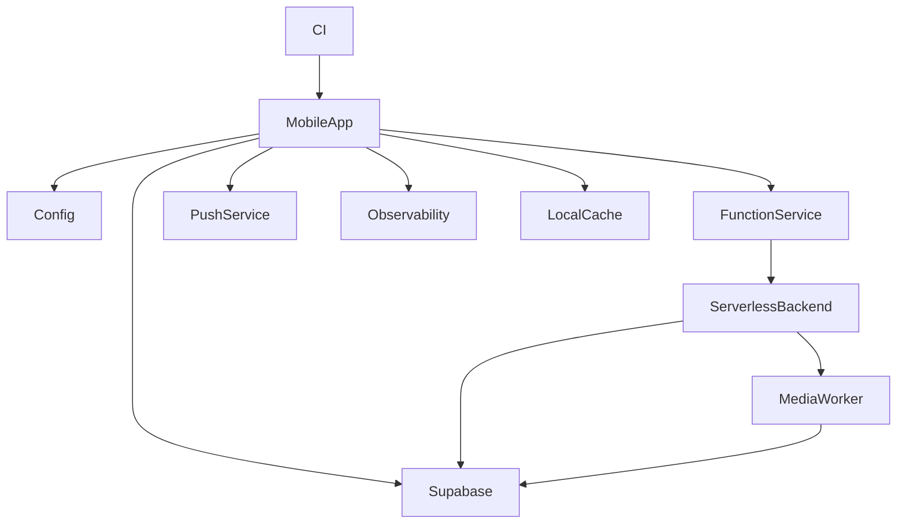
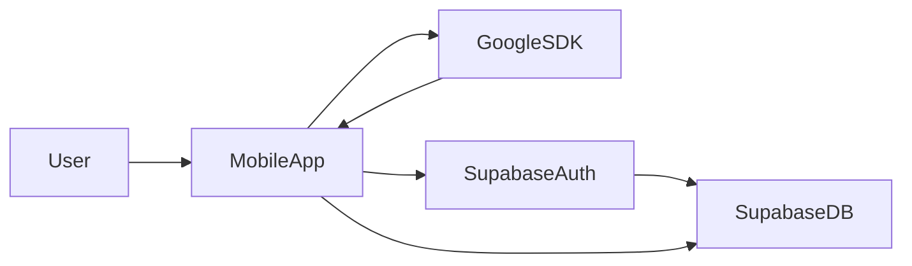
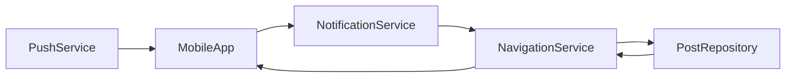
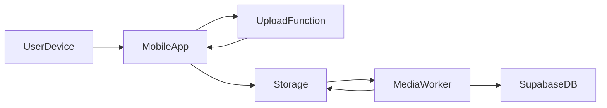
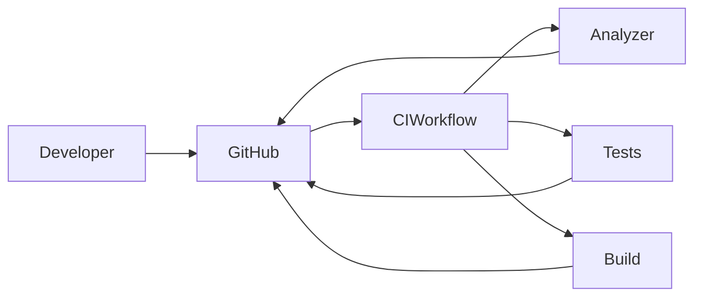

# Ments — Deep App Analysis & Roadmap

**Last updated:** 2026-02-24

## Executive Summary

- This document captures a full-scale, actionable analysis of the Ments Flutter app, why each change matters, and how to implement changes safely. It assumes no modifications to existing application logic in this PR: the goal is a clear roadmap, concrete steps, and technical guidance so maintainers can act in prioritized phases.

## Key Risks (Top Priority)

- Hardcoded secrets (Supabase URLs, anon keys, Google client IDs) present in source: rotate and remove immediately.
- Client-side enforcement of sensitive business logic with direct DB access: ensure server-side validation and strict Row-Level Security (RLS).
- Minimal automated tests and no CI pipeline: add tests and a CI workflow to prevent regressions.

## High-level Recommendations (what, why)

- Move configuration & secrets out of source and into environment/config stores. Why: prevent leakage and make key rotation simple.
- Centralize all Supabase endpoints and function URLs in a single configuration/service. Why: avoid duplication and simplify updates.
- Harden backend access with RLS policies and move sensitive ops to server functions with service-role keys. Why: protect data and restrict privileged actions.
- Add observability (Sentry/Crashlytics + structured logging). Why: faster debugging, fewer regressions, better production monitoring.
- Add automated test suites and CI (analyze -> test -> build). Why: reproducible verification before merging changes.

## Prioritized Roadmap (phases)

- Phase 0 — Emergency (1 day)
  - Remove secrets from public source; rotate Supabase anon keys and Google client secrets if they were exposed. (Owner: DevOps / Lead)
  - Create `.env.example` and stop committing secrets. (Owner: Dev)

- Phase 1 — Immediate (1–3 days)
  - Add a configuration layer and environment loader (`flutter_dotenv`) and a central `Config` service to read `SUPABASE_URL`, `SUPABASE_ANON_KEY`, `GOOGLE_CLIENT_ID`, and function base URL. Update code to read from the service (single PR per platform). (Owner: Dev)
  - Centralize endpoints: move repeated function URLs into `core/network/endpoints.dart` or `core/services/api_service.dart`. (Owner: Dev)
  - Audit and document all RLS policies in Supabase and ensure no privileged operations can be performed using anon keys. (Owner: Backend)

- Phase 2 — Short (1–2 weeks)
  - Implement server-side functions for sensitive ops (user creation, media upload validation, role escalations) and use service-role keys only on server. (Owner: Backend)
  - Add token lifecycle management for FCM tokens: refresh, delete on logout/uninstall. (Owner: Dev)
  - Integrate Sentry/Crashlytics and a structured logging library. (Owner: Dev)
  - Add unit tests for use-cases and repository classes; add widget tests for critical flows (Auth, Feed, Post creation). (Owner: QA/Dev)

- Phase 3 — Medium (3–8 weeks)
  - Add CI pipeline (GitHub Actions) to run `flutter analyze`, `flutter test`, and `flutter build --web/android/ios` smoke checks. (Owner: DevOps)
  - Move heavy processing (video compress/thumbnail generation) to background workers / Supabase Functions or dedicated serverless backends; add streaming uploads. (Owner: Backend)
  - Add monitoring dashboards (APM, error rate, latency, occasionally-run tasks). (Owner: DevOps)

- Phase 4 — Ongoing
  - Privacy policy updates, GDPR/CCPA compliance checks, logging retention policy.
  - Periodic key rotation, security audits, dependency upgrades.

## Detailed Implementation Guidance

1) Secrets & Config
   - What to do:
     - Add `flutter_dotenv` and create `lib/core/config/app_config.dart` that reads environment keys.
     - Remove all hardcoded values (examples found in `lib/main.dart` and multiple UI files). Provide `supabase` base URL and function paths via `APP_SUPABASE_URL` and `APP_FUNCTION_BASE_URL`.
   - Why:
     - Prevent secret leakage, enable safe rotation, support multiple environments (dev/staging/prod).
   - How (step-by-step):
     - Create `.env` with keys: `SUPABASE_URL`, `SUPABASE_ANON_KEY`, `GOOGLE_CLIENT_ID`.
     - Add `.env` to `.gitignore` and commit `.env.example` with placeholders.
     - Update initialization flows to use `dotenv.env['SUPABASE_URL']` etc. Example code snippet in doc (not modifying files now).

2) Centralize Endpoints
   - What to do: move all `https://...supabase.co/functions/v1/...` occurrences into a single `FunctionService.getUrl('get-image')`.
   - Why: single place to update and add authentication headers or signed URLs.
   - How: create `lib/core/services/function_service.dart` with `baseUrl` loaded from config and helpers like `getImageUrl(String s3Url)`.

3) Supabase Security & RLS
   - What to do: audit database policies; add strict RLS for tables such as `users`, `posts`, `user_devices`.
   - Why: anon keys can only do as much as RLS allows — ensure least privilege.
   - How:
     - For each table, ensure `SELECT` is allowed only when row owner or public-safe fields.
     - Move privileged tasks (e.g., upsert devices, mass updates) to signed server functions that validate input and run with service-role key.

4) Authentication Flows
   - What to do: move `GoogleSignIn` config into env; ensure idToken usage is verified on server.
   - Why: prevents leaks of client IDs and improves multi-platform configs.
   - How: replace hardcoded `serverClientId` with a call to `AppConfig.googleClientId`.

5) Notifications & FCM
   - What to do: improve token lifecycle and consent handling; ensure deep link payloads are validated.
   - Why: privacy and security; deep-link navigation must validate payloads before opening pages.
   - How: implement `NotificationService.updateFcmToken(userId)` on login and a `clearFcmToken` on logout. Validate `postId` is numeric/uuid and that the current user has access before fetching post.

6) Media Upload & Processing
   - What to do: verify uploads via server functions that check file size/type and produce signed upload URLs. Do heavy processing (compression / thumbnail generation) on serverless functions or background workers.
   - Why: mobile CPU and battery, consistent processing, easier to enforce policies and limits.
   - How: add `upload-post-media` function with multipart validation and S3 put-object signed URL generation. Offload thumbnail generation to a queue or background function.

7) Offline & Sync
   - What to do: document local caching strategy (CacheManager + sqflite) and add conflict resolution rules.
   - Why: prevent inconsistent state and user surprise.
   - How: standard optimistic UI + server reconciliation, add last_modified timestamps, and include retry/backoff policies.

8) Observability & Error Reporting
   - What to do: integrate Sentry (or Crashlytics) and add a simple `Logger` wrapper to collect structured logs.
   - Why: reduces MTTR and surfaces production issues.
   - How: initialize Sentry in `main` after Firebase init; replace `print`/`debugPrint` with `Logger.e()` or `Sentry.captureException`.

9) Testing & CI
   - What to do: add unit tests for domain/use-cases and repository mocking of Supabase client; add widget tests for the AuthGate and Post creation flow.
   - Why: catch regressions early and speed up onboarding.
   - How: use Mockito or `package:mocktail` to mock `SupabaseClient` and `GoogleSignIn`. Add GitHub Actions workflow: `.github/workflows/ci.yml` running `flutter analyze`, `flutter test`, and a `flutter build` smoke-check.

10) Performance
    - What to do: audit images/videos memory usage; lazily load heavy widgets; use isolates for CPU-bound tasks.
    - Why: improve app responsiveness and reduce OOM crashes on older devices.
    - How: offload `video_compress` to an isolate, use progressive image caching, and cap preview sizes.

## Security Checklist (Concrete)

- [ ] Remove hardcoded secrets and rotate exposed keys
- [ ] Add `.env` + `.env.example` and loader
- [ ] Centralize function URLs in `FunctionService`
- [ ] Audit and enforce RLS for all tables
- [ ] Move privileged operations to server functions (service-role only)
- [ ] Validate and sanitize all notification payloads before navigation
- [ ] Add input validation for all uploads and form fields
- [ ] Integrate security monitoring (Vuln scanner + Snyk/Dependabot)

## PR Checklist Template (for changes implementing above)

- Title: Short description + area (e.g., "chore(config): centralize supabase function URLs")
- Changes: describe files changed and why
- Security: list keys rotated and steps to revoke old keys
- Tests: list unit/widget/integration tests added
- Rollout: environment variables to add to CI / hosting

## Architecture Diagram (Mermaid)

```mermaid
flowchart LR
  A[Mobile App (Flutter)] -->|Auth via Google| B[Supabase Auth]
  A -->|Direct DB/API calls (anon key)| C[Supabase Postgres]
  A -->|Call| D[Supabase Functions]
  D -->|Signed image URLs| S3[(Storage / S3)]
  D -->|Upload| C
  B --> C
  A -->|FCM tokens| F[Firebase Cloud Messaging]
  F --> A
  C ---|RLS & Policies| R[Row Level Security]
  E[Serverless Backend / Admin] ---|Service-role key| D
  A -->|Local cache| L[CacheManager + sqflite]
  A -->|Monitoring| M[Sentry / Crashlytics]
  style A fill:#f9f,stroke:#333,stroke-width:1px
  style C fill:#ffe4b5
  style D fill:#e6f7ff
  style S3 fill:#fff2cc
  style F fill:#f0f0f0
  style E fill:#e6ffe6
```

Notes about the diagram:
- The mobile app should limit direct writes for sensitive operations — prefer calling server functions protected by service-role keys.

## Example env variables (no secrets here; list names only)

- SUPABASE_URL
- SUPABASE_ANON_KEY (only for client, limited by RLS)
- FUNCTION_BASE_URL
- GOOGLE_CLIENT_ID
- SENTRY_DSN

## Example migration steps to centralize endpoints (non-breaking)

1. Add `FunctionService` that reads `FUNCTION_BASE_URL`.
2. Change a single import across files to use `FunctionService.get('get-image')`.
3. Run integration smoke tests and verify all media calls still work.
4. Deploy rotated keys and update CI secrets.

## Effort Estimates (rough)

- Emergency secret rotation: 0.5–1 day
- Centralize config & endpoints: 1–2 days
- RLS audit & server functions for sensitive ops: 3–7 days
- Tests + CI: 3–5 days
- Media processing migration: 2–4 weeks

---

For reference, initial hardcoded locations were found in `lib/main.dart`, multiple `features/*` pages, and the `edit_experience_detail_page.dart` file. Use the centralized `FUNCTION_BASE_URL` to replace direct function URL string occurrences.

---

If you want, I can now:
- Create a branch and open a PR starter that only adds `flutter_dotenv`, `.env.example`, and a central `app_config.dart` (no runtime key changes), or
- Produce a file-by-file remediation list showing every file with hardcoded URLs/keys and suggested replacements (diff-ready).  

Pick one option or tell me a different next step.

---

## Boost the Ments App — Human-friendly Enhancements & Why They Matter

**Last updated:** 2026-02-24

This section lists practical upgrades you can add to the app to boost security, reliability, performance, and user delight. Each item explains what to add, why it helps (plain language), and a short implementation sketch and priority.

### 1) Secure Configuration & Secret Handling (Priority: Critical)
- What to add: Move all keys, URLs, and client IDs out of source into environment variables or secret stores (e.g., `.env`, CI secrets, platform secret managers).
- Why it helps (plain): If keys are in the code, anyone with access to the repo or a leak can impersonate your app or access your backend. Using env/secret stores keeps the keys private and makes rotating them easy.
- How (sketch): Add `flutter_dotenv` and `lib/core/config/app_config.dart`; commit `.env.example`; update init to read from `AppConfig`.
- Effort: small (0.5–1 day).

### 2) Centralized API & Function Endpoints (Priority: High)
- What to add: A single `FunctionService` or `Endpoints` class that holds all Supabase function base URLs and helpers like `getImageUrl()`.
- Why it helps: Right now the same URLs are repeated everywhere. Centralizing avoids mistakes, makes updates simple, and lets you add authorization headers in one place.
- How: Create `lib/core/services/function_service.dart` and replace hardcoded strings with `FunctionService.get('upload-post-media')`.
- Effort: small (1–2 days).

### 3) Harden Backend with RLS & Server Functions (Priority: Critical)
- What to add: Row-Level Security policies on tables and move privileged operations to server functions (service-role key only on server).
- Why it helps: Client code can be tampered with. Server-side rules ensure only authorized actions occur (e.g., only owners can edit their posts).
- How: Audit current Supabase policies, add explicit RLS for `users`, `posts`, `user_devices`, and implement server functions for media validation and role changes.
- Effort: medium (3–7 days; backend + testing).

### 4) Push Notifications — Consent & Lifecycle (Priority: High)
- What to add: Explicit UX for opt-in, robust token lifecycle (register on login, refresh periodically, remove on logout/uninstall), and payload validation before deep-links open a page.
- Why it helps: Users appreciate control over notifications; payload validation prevents malicious navigation.
- How: Update `NotificationService` to call `updateFcmToken()` on login and `clearFcmToken()` on logout; validate `postId` format and permissions before navigation.
- Effort: small (1–2 days).

### 5) Observability: Sentry + Structured Logging (Priority: High)
- What to add: Integrate Sentry (or Firebase Crashlytics) and use a small `Logger` wrapper to centralize logging.
- Why it helps: When crashes or unusual behavior happen, structured logs and error traces let you fix the root cause faster.
- How: Initialize Sentry in `main.dart` after Firebase init and replace ad-hoc `print` calls with `Logger.info/error`.
- Effort: small (1–2 days).

### 6) Tests & CI (Priority: High)
- What to add: Unit tests for use-cases + repositories, widget tests for key UIs (AuthGate, Create Post, Feed), and a GitHub Actions workflow that runs analyze/test/build on every PR.
- Why it helps: Prevents regressions, speeds up reviews, and raises confidence when refactoring.
- How: Add `mocktail` for mocking Supabase; create `.github/workflows/ci.yml` that runs `flutter analyze` and `flutter test`.
- Effort: medium (3–7 days depending on coverage goals).

### 7) Move Heavy Media Processing Off-Device (Priority: Medium)
- What to add: Offload video compression, thumbnail generation, and heavy image transforms to background workers or Supabase Functions.
- Why it helps: Saves CPU, battery, and memory on phones; gives consistent outputs and centralizes limits.
- How: Implement serverless media-processing functions that accept uploads and return signed URLs; or run processing on a queue.
- Effort: medium-to-large (2–4 weeks if migrating fully).

### 8) Improve Offline UX & Sync (Priority: Medium)
- What to add: Define a sync strategy: last-write-wins vs. merge, add retry/backoff for failed uploads, and surface offline status to users.
- Why it helps: Makes the app feel reliable on flaky networks and reduces user frustration.
- How: Use `CacheManager` + `sqflite` for local state, add `SyncManager` to reconcile changes, and show a small offline banner.
- Effort: medium (1–2 weeks).

### 9) Performance Tweaks (Priority: Medium)
- What to add: Use isolates for CPU-heavy tasks (video compress), lazy-load long lists, add pagination and prefetching for feeds, and enable image placeholders.
- Why it helps: Faster UI, fewer crashes on low-memory devices, better retention.
- How: Wrap compress calls in `compute()` or `Isolate`, use `ListView.builder` with prefetch, profile with DevTools.
- Effort: small-to-medium (1–2 weeks for thorough work).

### 10) UX Polishes that Boost Retention (Priority: Low-to-Medium)
- What to add: onboarding improvements (progress, permissions explained), smoother transitions, retry UIs for failed uploads, and contextual help for first-time users.
- Why it helps: Better first impressions and fewer user drop-offs.
- How: Add a short onboarding flow with clear permission prompts; reuse current pages to show inline tips.
- Effort: small (1–2 weeks depending on scope).

---

Mermaid Diagram — how these enhancements connect (GitHub-compatible)



Additional Diagrams

1) Authentication Flow (user sign-in via Google + Supabase)



2) Notification Deep-link Flow



3) Media Upload & Processing Flow



4) CI/CD Pipeline (PR -> checks -> merge)



Notes about the diagram (plain):
- `Config` holds secrets and environment values — keep them out of source.
- `Endpoints` centralizes function URLs so the app never hardcodes strings.
- `Server` runs privileged tasks (media validation, uploads, username generation) using a secure key not shipped to devices.
- `Media` worker does heavy CPU tasks off-device and writes results to storage/postgres.
- `Sentry` and `CI` are cross-cutting: they help you find issues early and prevent regressions.

